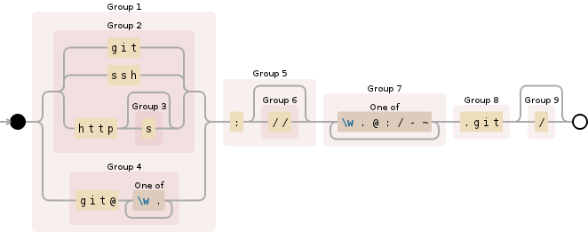

# What Changed
A git log aggregator

# testing

  * start server: `php -S 0.0.0.0:8080 -t public/ public/index.php`
  * create tunnel proxy `ngrok http 8080` (it will give you a public uri like: `http://8e262c42.ngrok.io -> localhost:8080`)
  * edit webhooks for your test repository to `http://8e262c42.ngrok.io/application/gitlab/hook`
  
  
# git url protocol regex
  
  `((git|ssh|http(s)?)|(git@[\w\.]+))(:(//)?)([\w\.@\:/\-~]+)(\.git)(/)?`
  
  
  From [stack overflow](http://stackoverflow.com/questions/2514859/regular-expression-for-git-repository)